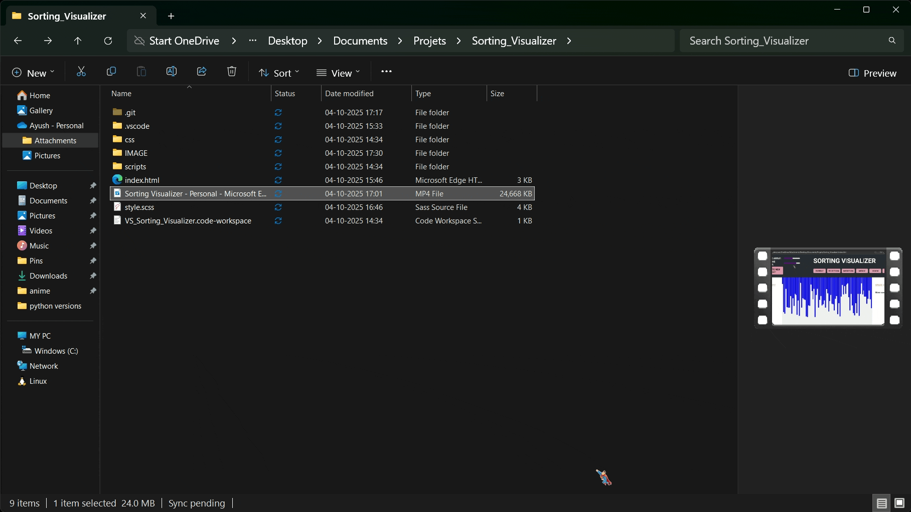

# 🎨 Sorting Visualizer

An **interactive web app** that visualizes popular sorting algorithms with colorful animations! Watch how arrays are sorted step by step, understand the process, and learn the complexities of each algorithm. 🌈✨

---

## 🚀 Features

* **🎯 Visualize Algorithms** – Step-by-step animations for all included sorting algorithms.
* **🔢 Adjustable Array Size** – Change the number of elements dynamically.
* **⚡ Speed Control** – Adjust how fast the sorting happens.
* **📊 Complexity Display** – Shows **Time & Space Complexity** for selected algorithm.
* **💻 Responsive Design** – Works on desktop & mobile.
* **🎨 Interactive UI** – Colored bars indicate comparisons, swaps, and sorted elements.

---

## 🧮 Algorithms Included

1. **🔹 Bubble Sort** – Simple comparison-based sorting.
2. **🔹 Selection Sort** – Selects the minimum element and places it in the correct position.
3. **🔹 Insertion Sort** – Builds a sorted array one element at a time.
4. **🔹 Merge Sort** – Divide & conquer approach with O(n log n) complexity.
5. **🔹 Quick Sort** – Efficient divide & conquer algorithm using a pivot.
6. **🔹 Heap Sort** – Sorting using a binary heap data structure.

---

## 📂 Project Structure

```
Sorting-Visualizer/
│
├── index.html           # Main HTML file
├── style.css            # CSS styling for UI
├── config.js            # Shared configuration variables
├── visualizations.js    # Visualization functions & speed control
├── main.js              # Main logic: array generation & event listeners
├── bubble_sort.js       # Bubble Sort algorithm
├── selection_sort.js    # Selection Sort algorithm
├── insertion_sort.js    # Insertion Sort algorithm
├── merge_sort.js        # Merge Sort algorithm
├── quick_sort.js        # Quick Sort algorithm
├── heap_sort.js         # Heap Sort algorithm
└── README.md            # Project documentation
```

---

## 🛠️ How to Use

1. Clone the repository:

```bash
git clone https://github.com/your-username/sorting-visualizer.git
```

2. Open `index.html` in your browser. 🌐

3. Use the **array size slider** to select the number of elements. 🔢

4. Click **Generate Array** to create a new random array. 🎲

5. Choose an **algorithm button** to visualize sorting. 🖱️

6. Adjust the **speed slider** to control visualization speed. ⚡

---

## 🖌️ Technologies Used

* **HTML5** – Structure of the app.
* **CSS3 / SCSS** – Styling & responsive design.
* **JavaScript (ES6 Modules)** – Sorting logic & animations.
* **DOM Manipulation** – Dynamic updates of array bars.
* **setTimeout()** – Controls animation speed. ⏱️

---

## 📸 Screenshots

  




---

## ✨ Future Enhancements

* Add more sorting algorithms (**Radix Sort, Counting Sort**).
* **Dark/Light Mode** toggle 🌙☀️.
* **Step-by-step control** to pause/play sorting ⏯️.
* Optimize mobile experience with touch gestures 📱.

---

## 📜 License

This project is open-source under the **MIT License**. 📝

---

## 👤 Author

**Ayush Nagdive** – Passionate developer & CS student 💻
[GitHub](https://github.com/avio-dels) | [Portfolio](https://avio-dels.github.io/My_Portfolio/)

---
